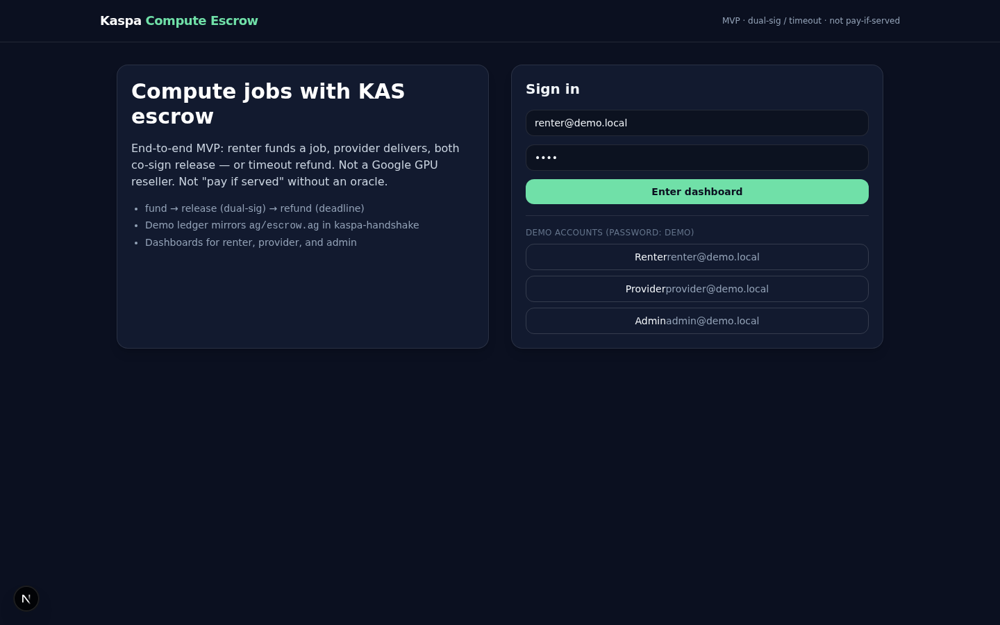
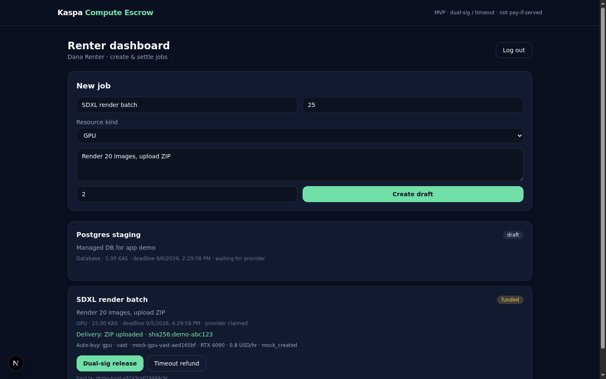
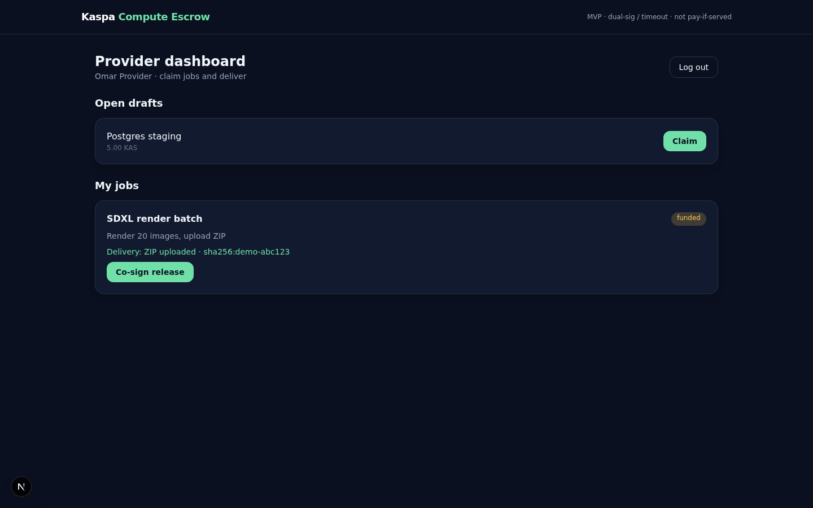
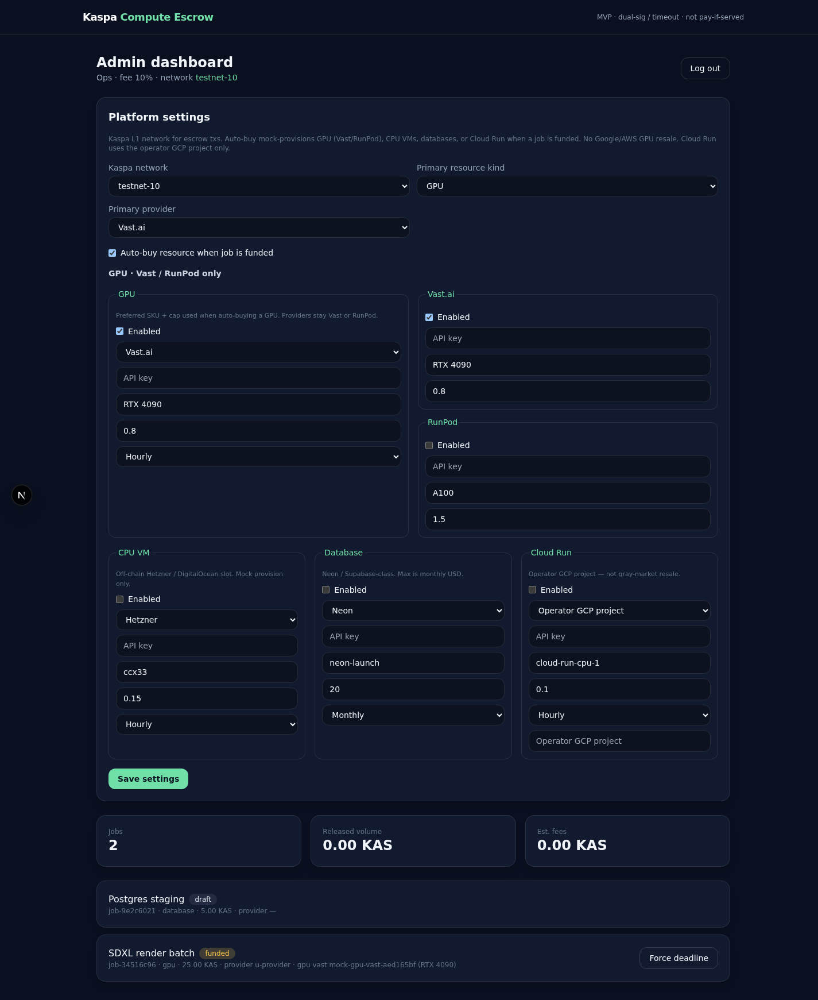

# Kaspa Compute Escrow (public)

Public overview of an indie Kaspa L1 product: **dual-sig / timeout job escrow** for multi-resource compute (GPU, CPU VM, DB, Cloud Run metadata) — settlement on Kaspa covenants, vendors stay off-chain.

> **Source code is private.** This repo is docs, screenshots, and product notes only.

## What it is
- Renter funds a job in KAS escrow
- Provider delivers
- Dual-sig release **or** timeout refund (DAA-gated on-chain path in progress)
- Not “pay if served” / no oracle in v0
- Not Google/AWS GPU resale

## Screenshots (demo UX)
Demo ledger UI — not live settlement yet.

### Landing

### Renter

### Provider

### Admin

## Monetization (indie)
| Sold | Price |
|---|---|
| Escrow fee | 150 bps on funded amount (0 bps while public demo) |
| Pro SaaS | $49/mo (multi-resource admin, live keys, logs) — after durable store |

Vendor costs (Vast/RunPod/Hetzner/Neon/…) are pass-through under caps.

## Roadmap (public)
1. ~~Marketplace demo UI~~ (private app)
2. On-chain `Payout` + DAA refund assert (handshake PR in progress)
3. **testnet-10** wallet connect + real fund/release/refund submits
4. Public demo URL (Vercel) with serverless-safe store
5. File Unlock product on same escrow engine

## Kaspa-native why
Atomic multi-party UTXO escrow on L1 covenants (Toccata/Argent) — not an account-model escrow clone.

## Contact
Built by Daniel Haimov as an independent Kaspa side developer.
